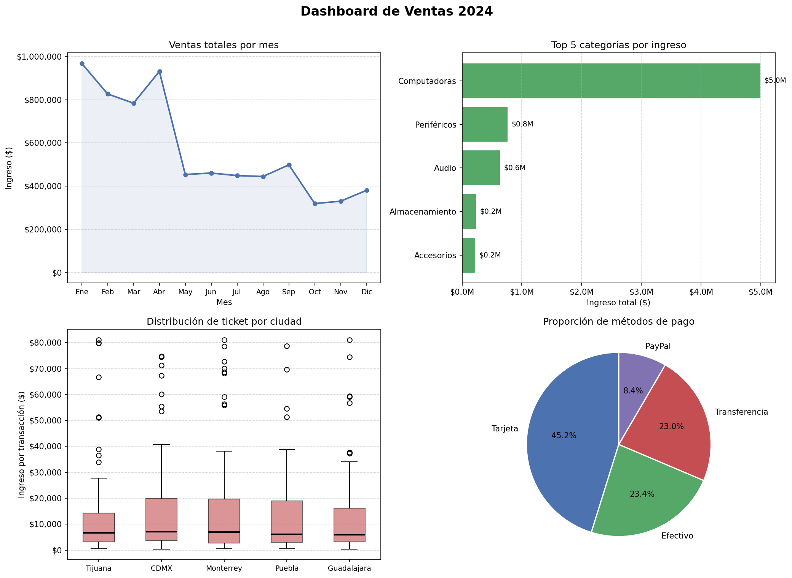

# 🔷 Pandas + Matplotlib — Análisis de Datos y Visualización

Tres ejercicios progresivos que cubren desde limpieza básica de datos
hasta un pipeline completo de análisis con dashboard visual.

---

## Ejercicio 1 — Análisis de empleados (Nivel básico)

### ¿Qué problema resuelve?
Exploración y limpieza de un dataset de 20 empleados,
rellenando valores nulos con la mediana de cada departamento
e identificando a los empleados más valiosos.

### Conceptos demostrados
- Exploración con `.info()`, `.describe()`, `.value_counts()`
- Limpieza de nulos con `.groupby()` + `.transform('median')`
- Filtrado con condiciones booleanas múltiples
- Ordenamiento y selección del top N

### Resultado
```
Nulos en salario:     4 registros rellenados con mediana del departamento
Empleados activos
con más de 3 años:    x empleados
Top 5 por salario:    [tabla con los 5 mejor pagados activos]
```

---

## Ejercicio 2 — Ventas por región (Nivel intermedio)

### ¿Qué problema resuelve?
Análisis de 120 registros de ventas de productos electrónicos
en 5 regiones, identificando las combinaciones más rentables
y el crecimiento mes a mes.

### Conceptos demostrados
- Unión de DataFrames con `pd.merge`
- Columna calculada: `ingreso = cantidad * precio * (1 - descuento)`
- Tabla dinámica con `pivot_table`
- Crecimiento mes a mes con `.pct_change()`
- Identificación del máximo con `.idxmax()`

### Resultado
```
Región y categoría más rentable: ('x', 'Computadoras')
Pivot table: filas=región, columnas=categoría, valores=ingreso total
Crecimiento mensual por región: tabla con variación porcentual
```

---

## Ejercicio 3 — Dashboard e-commerce (Nivel avanzado)

### ¿Qué problema resuelve?
Pipeline completo de análisis sobre 500 transacciones de una tienda
online durante 2024, incluyendo segmentación de clientes y
visualización ejecutiva en un dashboard de 4 gráficas.

### Conceptos demostrados
- Generación de datos sintéticos realistas con NumPy
- Métricas de negocio: clientes únicos, ticket promedio, categoría líder
- Análisis RFM simplificado (Recencia + Frecuencia)
- Segmentación de clientes con `pd.qcut`
- Dashboard con 4 tipos de gráfica en Matplotlib

### Métricas obtenidas
```
Clientes únicos:        183
Ticket promedio:        $13,699.24
Categoría más vendida:  Computadoras
```

### Segmentación RFM
```
Segmento Alto:   ~33% de clientes  (mayor frecuencia de compra)
Segmento Medio:  ~33% de clientes
Segmento Bajo:   ~33% de clientes  (menor frecuencia de compra)
```

### Dashboard generado



El dashboard incluye:
- 📈 Ventas totales por mes — identifica estacionalidad
- 🏆 Top 5 categorías por ingreso — Computadoras domina con $5.0M
- 🎯 Distribución de ticket por ciudad — distribución similar entre ciudades
- 💳 Métodos de pago — Tarjeta lidera con 45.2%

### Tecnologías usadas
```
pandas      — limpieza, agrupación, pivot tables, RFM
numpy       — generación de datos sintéticos
matplotlib  — 4 subplots: línea, barras, boxplot, pie chart
```
